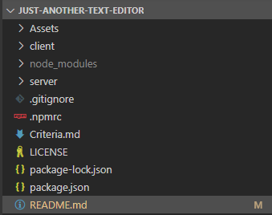
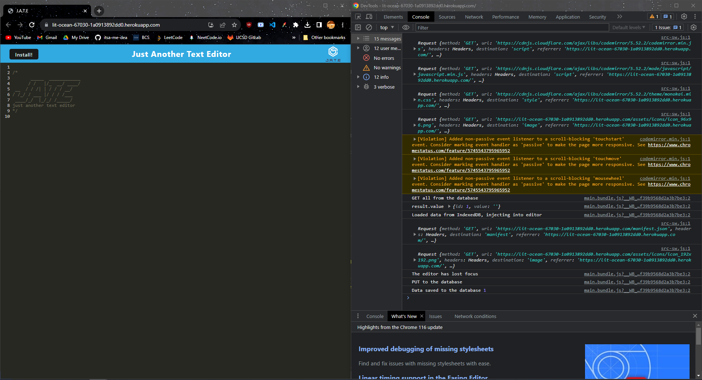

# Just Another Text Editor (J.A.T.E.)

### **[Description](#description) | [Installation](#installation) | [Usage](#usage) | [Credits](#credits) | [License](#license) | [Contribute](#contribute) | [Questions](#questions)**

## Description

<!-- My motivation was to build the back end for an social media site that creates and holds a database for `Users` and posts (aka `Thoughts`). There is meant to be interactability between users in forms of `friends` and `reactions` to user posts.

This creates a site that utilizes back-end features by configuring Express.js API to use Mongoose and interact with a NoSQL database. I learned a great deal on how work with json, Isomnia, NoSQL, and Mongoose. Additionally, I found these options to be better alternative to NoSQL and Sequalize. I learned to utilize CRUD methods, virtuals, getters and even got more familiar with using NPM. -->

## Installation

Deployed site (installation not needed): https://lit-ocean-67030-1a0913892dd0.herokuapp.com/

-OR-

Forking from Repo:
1. Fork or download repository
2. Open a terminal with the root directory
3. In the terminal, enter `npm i`
4. Enter `npm run build`
5. Enter `npm run start`
6. Open http://localhost:3000 in browser

## Usage

To review the webpage / application features, you can open up the DevTools (`Ctrl+Shift+I`) and navigate through the features. 

> **NOTE:** To consolidate, all images are displayed within the dropdown below.

  
J.A.T.E. Working Images

    
  The image below shows the Client-Server folder structure:  

  
    
    WHEN I run `npm run start` from the root directory
    THEN I find that my application should start up the backend and serve the client
    WHEN I run the text editor application from my terminal
    THEN I find that my JavaScript files have been bundled using webpack
    WHEN I run my webpack plugins
    THEN I find that I have a generated HTML file, service worker, and a manifest file
    
   
   hello 
    
    
  The image below shows the text editor still functioning in the browser without errors:

    
    
    
    WHEN I open the text editor
    THEN I find that IndexedDB has immediately created a database storage
    WHEN I enter content and subsequently click off of the DOM window
    THEN I find that the content in the text editor has been saved with IndexedDB
    WHEN I reopen the text editor after closing it
    THEN I find that the content in the text editor has been retrieved from our IndexedDB
    
   
   hello 
    
    
    WHEN I click on the Install button
    THEN I download my web application as an icon on my desktop
    WHEN I load my web application
    
   
   hello 
    
    
    THEN I should have a registered service worker using workbox
    WHEN I register a service worker
    THEN I should have my static assets pre cached upon loading along with subsequent pages and static assets
    
   

## Credits

<!-- - Collaborators: 
  - N/A.
- Third-party assets: 
  - https://expressjs.com/
  - https://day.js.org/
  - https://mongoosejs.com/
  - https://www.npmjs.com/package/mongoose-unique-validator
- Tutorials: 
  - UCSD-VIRT-FSF-PT-03-2023-U-LOLC
  - https://stackoverflow.com/questions/18022365/mongoose-validate-email-syntax
  - https://stackoverflow.com/questions/67680295/node-js-mongoose-findone-id-req-params-id-doesnt-work
  - https://stackoverflow.com/questions/69574924/express-custom-json-response
  - https://stackoverflow.com/questions/23502367/getter-and-setter-methods-in-model-class
  - https://stackoverflow.com/questions/54992810/update-many-in-mongoose
  - https://chat.openai.com/share/d53b354a-e690-47fb-a59b-6f4e303ee204
  - https://chanwingkeihaha.medium.com/do-you-know-the-unique-option-is-not-a-validator-in-mongoose-85267fb1a085
  - https://stackoverflow.com/questions/33627238/mongoose-find-with-multiple-conditions
  - https://masteringjs.io/tutorials/mongoose/updatemany -->

## License

 The license this application is covered under is: [MIT License](https://mit-license.org/).

## Contribute

In general, follow the "fork-and-pull" Git workflow.

  1. **Fork** the repo on GitHub.
  2. **Clone** the project to your own machine.
  3. **Commit** changes to your own branch.
  4. **Push** your work back up to your fork.
  5. Submit a **pull request** so that your changes can be reviewed.
    
  NOTE: Be sure to merge the latest from "upstream" before making a pull request!
  
  When contributing to this project, please follow the [Contributor Covenant](https://www.contributor-covenant.org/version/2/1/code_of_conduct/) code of conduct.

## Questions

My gitHub username is [itsa-me-dea](https://github.com/itsa-me-dea), and you can contact me at wachadea@gmail.com.
